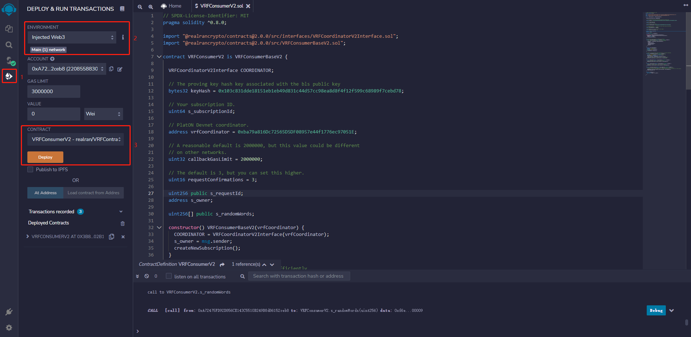
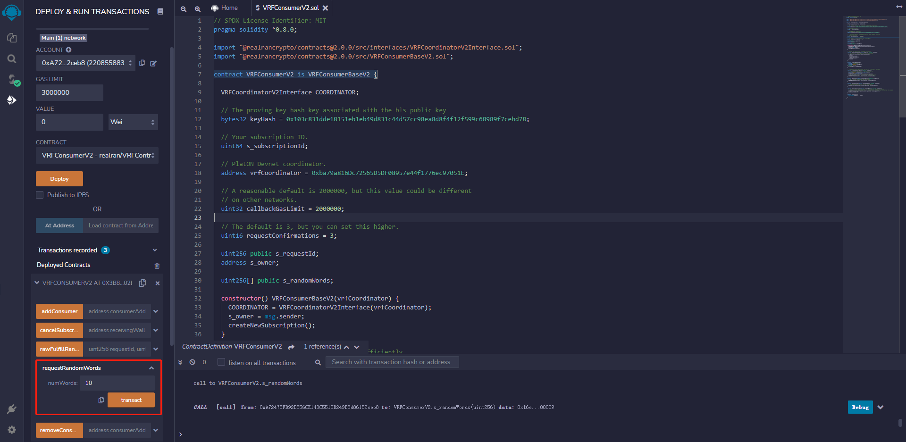

## Introduction

PlatON built-in contract (contract address: `0x3000000000000000000000000000000000000001`) provides a function to generate VRF. The contract supports returning up to 500 random values in a byte array, in which every chunk of 32 bytes represents a random value. To help developers easily use the VRF service, the VRF contract encapsulates calls to the built-in contract and the `VRFCoordinator` contract also provides pragmatic functions, such as **subscription creation**, **consumer registration**, **synchronous/asynchronous random value generation**, **contract event emitting** and others.  

## Contract overview

The current version is `PlatON VRF v1`. In this version, the generated random values will not be verified on the chain. Also, developers or consumers need not pay fees for gas consumption of the callback triggered by the `VRFCoordinator` contract during the asynchronous request of random values. However, the related parameters and implementations are reserved in the contract. When integrating with the version, developers should ignore them first and use default values.  


To use PlatON VRF, follow the steps below (Developers could refer to the `VRFConsumer.sol` sample contract):

1. Get the `VRFCoordinator` address based on the network in the <a href="#preparation">Preparation section</a> and update the `vrfCoordinator` address in the  `VRFConsumer.col`.
2. Deploy the `VRFConsumer.col` contract. This example contract includes the `createNewSubscription()` function in the `constructor()` that creates the subscription and adds itself as a consumer automatically when you deploy it.
3. Call the `syncRequestRandomWords()` function in the `VRFConsumer.col` contract to synchronously get random values.
4. Or call the `requestRandomWords()` function in the `VRFConsumer.col` contract to asynchronously request random values which are returned via the callback function `fulfillRandomWords()`.


One simple example is shown below to demonstrate how to use Remix IDE to deploy the `VRFConsumer.sol` contract on PlatON and get random values. 

##  Preparation
- MetaMask
- The Remix IDE
- PlatON RPC URL:
	- Mainnet: `https://openapi2.platon.network/rpc`
	- Devnet: `https://devnetopenapi2.platon.network/rpc`
- `VRFCoordinator` contract address：
	- Mainnet: `0x57baeE54708657302E96004279a15D7c98cD1a42`
	- Devnet: `0x356d552150f460f57Cd722DC4f3D03A3f2B8386C`
	
## MetaMask Setup

MetaMask is the most widely used browser plug-in wallet and users can easily interact with PlatON Devnet and Mainnet. See the [MetaMask Configure PlatON/Alaya Network](https://devdocs.platon.network/docs/en/MetaMask/) to learn to use it.

>> Tip: You can get some test LATs on Devnet from [faucet](https://faucet.platon.network/faucet/?id=e5d32df10aee11ec911142010a667c03).

## Deploy a VRF consumer contract

### Import VRFContract Repo

Open [Remix](https://remix.ethereum.org/) and import [VRFContract contracts](https://github.com/realran/VRFContract)

 


For this example, use the `VRFConsumer.sol` sample contract in the sample folder. This contract imports the following dependencies:
  - `VRFCoordinator.sol`
  - `VRFConsumerBase.sol`

The contract also includes pre-configured values for the necessary request parameters such as `keyHash`, `callbackGasLimit`, and `requestConfirmations`. When you deploy your own contract, you can use the same value as provided in the contract. For the parameter `vrfCoordinator`, You can change its value based on different networks.

###  Compile the `VRFConsumer.sol` contract


1. Open the `VRFConsumer.sol` contract in Remix.
2. Click the **Solidity compiler** tab on the left sidebar.
3. Click the **Compile VRFConsumer.sol** button. Ignore the warnings here.

###  Deploy the `VRFConsumer.sol` contract

Before the deployment, please get the `VRFCoordinator` address based on the network in the <a href="#preparation">Preparation section</a>. In the `VRFConsumer.sol` contract, use **Devnet's** `VRFCoordinator` address.




1. On the Remix left sidebar, click the **Deploy & run transactions** tab.
2. select the **Injected Web3** Environment.
3. Select the `VRFConsumer` contract and click the **Deploy** button. MetaMask opens and asks you to confirm the transaction.

### Request random values

The deployed `VRFConsumer` contract requests random values from `VRFCoordinator`, receives those values, and stores them in the `s_randomWords` array. Run the `syncRequestRandomWords()` function to synchronously request them.

1. Request 10 VRF values



2. Get the 10th VRF value at index 9


## Analyze the `VRFConsumer` contract

 ```
// SPDX-License-Identifier: MIT
pragma solidity ^0.8.0;

import "../dev/VRFCoordinator.sol";
import "../VRFConsumerBase.sol";

contract VRFConsumer is VRFConsumerBase {
  VRFCoordinator COORDINATOR;
  
  // PlatON DevNet coordinator. 
  address vrfCoordinator = 0x356d552150f460f57Cd722DC4f3D03A3f2B8386C;
  
  // The gas lane to use, which specifies the maximum gas price to bump to.
  bytes32 keyHash = 0xd89b2bf150e3b9e13446986e571fb9cab24b13cea0a43ea20a6049a85cc807cc;

  // Your subscription ID.
  uint64 s_subscriptionId;

  // Depends on the number of requested values that you want sent to the
  // fulfillRandomWords() function. Storing each word costs about 20,000 gas,
  // so 100,000 is a safe default for this example contract. Test and adjust
  // this limit based on the network that you select, the size of the request,
  // and the processing of the callback request in the fulfillRandomWords()
  // function.
  uint32 callbackGasLimit = 100;

  // The default is 3, but you can set this higher.
  uint16 requestConfirmations = 100;

  uint256 public s_requestId;
  address s_owner;

  uint256[] public s_randomWords;

  constructor() VRFConsumerBase(vrfCoordinator) {
    COORDINATOR = VRFCoordinator(vrfCoordinator);
    s_owner = msg.sender;
    //Create a new subscription when you deploy the contract.
    createNewSubscription();
  }

  // Create a new subscription when the contract is initially deployed.
  function createNewSubscription() private onlyOwner {
    // Create a subscription with a new subscription ID.
    address[] memory consumers = new address[](1);
    consumers[0] = address(this);
    s_subscriptionId = COORDINATOR.createSubscription();
    // Add this contract as a consumer of its own subscription.
    COORDINATOR.addConsumer(s_subscriptionId, consumers[0]);
  }

  // Assumes the subscription is funded sufficiently.
  function requestRandomWords(uint32 numWords) external {
    // Will revert if subscription is not set and funded.
    s_requestId = COORDINATOR.requestRandomWords(
      keyHash,
      s_subscriptionId,
      requestConfirmations,
      callbackGasLimit,
      numWords
    );
  }

  // Assumes the subscription is funded sufficiently.
  function syncRequestRandomWords(uint32 numWords) external {
    // Will revert if subscription is not set and funded.
    uint256[] memory randomWords = COORDINATOR.syncRequestRandomWords(
      keyHash,
      s_subscriptionId,
      requestConfirmations,
      callbackGasLimit,
      numWords
    );
    s_randomWords = randomWords;
  }

  function fulfillRandomWords(
    uint256, /* requestId */
    uint256[] memory randomWords
  ) internal override {
    s_randomWords = randomWords;
  }

  modifier onlyOwner() {
    require(msg.sender == s_owner);
    _;
  }
}
 ```

 In this example, The `VRFConsumer` contract address is the `VRFCoordinator` subscription owner and uses that subscription. The consumer contract uses static configuration parameters.

 The contract includes the following parameters:

  - `s_subscriptionId`: the subscription ID.
  - `vrfCoordinator`: the address of the PlatON VRFCoordinator contract.
  - `s_randomWords`: used to store random values.


 The contract includes the following functions:

  - `createNewSubscription()`: creates a new subscription and add the consumer itself to the subscription when the contract is initially deployed.
  - `requestRandomWords()`: requests random values asynchronously.
  - `fulfillRandomWords()`: receives random values and stores them with the contract.
  - `syncRequestRandomWords()`: requests random values synchronously.
